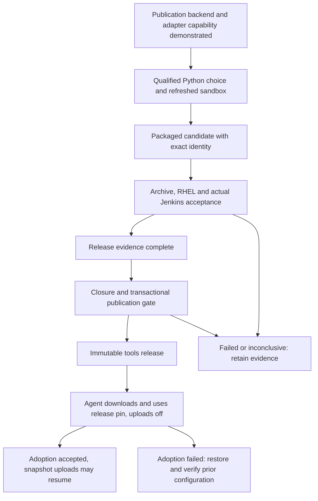

# Design v0.27.0: rebuild, qualify and publish the tools archive

Reference requirement:
[tools-archive-rebuild](feature-request.v0.27.0.tools-archive-rebuild.md).
Umbrella: [Debian agent tools](draft.v0.27.0.debian-agent-tools.md), item 7.

## Context and scope for the final tools archive

Items 1 to 6 provide the completed build, packaging, relocation, wrapper,
closure and SQLite mechanisms. This design composes them into a release
candidate, qualifies that candidate on the actual consuming platforms, and
connects its acceptance to immutable publication and application adoption.

The requirement's AR1-AR4, PA1-PA11 and RA1-RA8 remain the acceptance contract.
Its five consolidated clarifications are settled inputs. This design does not
reselect the coverage policy, platform matrix, Python selection rule or
recovery policy. The major interfaces proposed here are a release evidence
record, a candidate input to the existing application flow, wheel inputs to
the existing D10 policy, and the real publication adapter.

Python 3.14, free-threading, a replacement agent image, host package additions,
a Git rebuild and the separate rsync follow-up remain outside this effort.
The later implementation plan owns file assignments, commands and rollout.

## Confirmed technical facts for v0.27.0 tools-archive-rebuild

These facts were checked in the current cplx source and the consuming
application working tree. They describe available mechanisms, not successful
acceptance of an item 7 candidate.

| Existing mechanism | Confirmed behavior and design consequence |
| --- | --- |
| `src/setups/env/bin/pkg_tools.sh` | Builds a private hardlink stage, trims build-only payload there, preserves loader identities, and calls `pkg.sh tools --closure-gate --source-root`. The gate and tar see the same staged tree; the live build tree remains separate. |
| `src/setups/env/bin/pkg.sh` | Stages the deployed declaration, envelope and checker copies; checks their consistency; emits timestamped archives and SHA-1 records under the caller's `~/pkgs`. It cannot package tools without the gate. |
| `src/install/env/python/python_install_functions.sh` | Configures Python against sandbox SQLite headers/libraries and invokes the existing SQLite probe for build and installed roles. |
| `src/setups/env/bin/closure_verify.sh` | Requires separately delivered verification tools, computes the archive SHA-256, derives pre-install and installed observations, and emits archive-keyed evidence. Embedded candidate scripts cannot certify themselves. |
| `src/setups/env/bin/closure_d10.sh` | Reads all shipped ELF subjects, measures GCC 11 and GCC 12 provider capabilities, and applies the existing bounded convergence policy. Its present public input is one subject root plus candidate roots. |
| `src/setups/env/bin/closure_publish.sh` | Resolves release-commit configuration, requires matching archive-keyed verification, repeats static checks, refuses active waivers, and streams an open archive descriptor through a transactional adapter. Default adapter functions refuse. |
| Application `tools/publish_pdf_nexus.sh` | `--with-tools` publishes tools only, accepts an explicit archive argument, requires `--version`, and otherwise selects `tools.latest.tar.gz`. It invokes Maven with a pathname, preflights the POM, and compares SHA-1 afterward. It does not currently implement the closure adapter's transaction. |
| Application Jenkins flow | Reads `tools/tools.version` and `tools/publish.mode` at startup. Its separate SQLite diagnostic can fetch a candidate and verification bundle by independent SHA-256 pins. The main test command still disables coverage and pytest-testmon. |

The older `tools/tools.validation` path targets an item 4 snapshot coordinate;
it is not the selected transport for this item. Item 6's archive-copy route
proved SQLite in a dedicated diagnostic prefix. That diagnostic alone does
not make the main application chain consume the candidate.

[The environment reference](reference.environments.md) owns platform and
access roles. Its historical report-only ABI behavior describes the current
pipeline; this item's requirement explicitly makes the adopted ABI check
blocking. Actual Debian userland and container/image identity must be observed,
not inferred from the shared host kernel.

## Target release state model for tools-archive-rebuild

An archive file is a candidate, not a release authorization. An ordinary
Jenkins success is insufficient if diagnostics were inconclusive or the main
application ran another interpreter. Every required result must refer to the
identified candidate and the relevant application/runtime inputs.

Publication eligibility is determined before the immutable coordinate is
used. Adoption is a later state that requires a run through the normal
published release pin. The candidate transport is absent from that later run.

## Candidate construction and authority for the tools release

The RHEL build uses item 5's resolved package lists and architecture index to
refresh a coherent sandbox without installing host packages. It explicitly
sets the selected `CPLX_VERSION`. The release record retains dated upstream
sources and the requirement's conclusive 3.13.15 versus 3.13.14 decision;
automatic repository tag selection is not an input to this release.

The build preserves item 6's SQLite headers/provider selection, compiled
`_sqlite3`, and same-process file-backed database acceptance. A successful
non-release item 6 artifact cannot certify this candidate. Build, relocated
Debian and deployed RHEL roles each supply their own SQLite result.

Packaging continues through the existing private stage. Archive cleanup and
relocation acceptance refer to the actual packaged inventory: remove the
residual `tools/python/root/a.out`, discharge every item 2 handoff member with
its owner, and retire stale ownership entries. Preserve migration positivity,
case 5 equality, the three HOME states and force reinstall. Inventory changes
that invalidate a prior measured scope require its reviewed amendment and
renewed validation, rather than exclusions to obtain zero flags.

The closure declaration remains an independently authorized input. The release
record keeps these identities distinct:

| Identity | Meaning |
| --- | --- |
| Source-envelope commit and declaration digest | Exact source blob underlying the delivered declaration/envelope pair. |
| Final cplx revision supplied to publication | Separately resolvable release history whose declaration must match the archive envelope. |
| Completed archive SHA-256 | Exact compressed bytes accepted and handed to publication. |

For the current declaration, the source commit retained by item 6 remains the
starting authority. The publishing checkout must resolve it. If refresh or
Python selection changes the declaration, apply the complete
[item 6 Step 3 renewal contract](plan.v0.27.0.python-sqlite-support.md#step-3-bind-the-candidate-layout-to-its-closure-declaration),
including its concrete authorization boundary, paired delivery, retention
merge and fresh single-branch clone proof. Neither a digest edit nor a
temporary source ref replaces that contract.

## Release evidence composition and invalidation

The proposed release record is a structured sidecar outside the archive,
indexed by its SHA-256. It aggregates references to existing evidence rather
than changing the closure result grammar or placing evidence inside the bytes
whose digest it names. A human-readable acceptance view presents the same
record for review.

The structured record and its acceptance view are versioned cplx evidence
under this effort's `docs/v0.27.0/` directory. The plan chooses their exact
filenames. Raw captures remain in their retained evidence locations, bound by
identity and digest; an ignored local file alone is not durable release
evidence. The release maintainer updates the record from candidate acceptance
through publication, adoption or recovery, retaining prior states in history.
A cplx-owned release validator checks the record and its referenced evidence
at the application's publication entry, before the closure gate can invoke
the adapter. It checks adoption completeness again before item 7 is completed.

The versioned record follows the same sanitization rule as item 6's acceptance
record: environment, container and runtime identities appear as evidence,
while account paths, workspace paths and access details remain in the ignored
captures it references.

| Record area | Required content |
| --- | --- |
| Candidate | Timestamped filename, byte size, SHA-256, packaging SHA-1, explicit Python version, payload identities and regression decision sources/date. |
| Authority | Source-envelope commit, declaration digest, cplx release revision, authority checks and any renewal proof. |
| Consumers | Application and pipeline revisions, dependency lock digest, resolved wheel filenames/digests, venv base interpreter identity. |
| Environments | Run/build identifier, observed OS, actual image/container identity for Debian, runtime/provider identities and transfer digest checks. |
| Results | Required AR/PA cells and RA obligations, status, referenced capture identities, producing run, and affected input identities. |
| D10 | Reading generation, every consumer and required node, both candidate capabilities, selected generation and any second reading. |
| Change assessment | Release maintainer's affected/unaffected decision, repeated results and explicit reasons for retained results. |
| Publication and adoption | Selected release coordinate, published SHA-1 and SHA-256 association, retrieval confirmation, pin/configuration revisions, adoption or recovery result. |

Result states distinguish pending, pass, fail, inconclusive and not applicable.
Only the requirement's optional or inapplicable cells can be omitted from a
gate; an empty result is pending. A pass requires identified, retained evidence
and a conclusive result. The record validates completeness and identity
consistency; it does not independently prove arbitrary maintainer prose true.

Before publication, the release gate requires all pre-publication obligations,
including Jenkins PA9 and the real uploader capability, plus the unchanged
closure publication gate. RA6 and post-publication portions of RA5/RA8 are
pending adoption obligations, not circular prerequisites for publication.
Completion requires those later obligations too; successful recovery leaves
item 7 incomplete.

A changed archive creates a new candidate identity. Changed application,
lock, wheels, pipeline or runtime inputs make dependent results pending until
the maintainer records the impact assessment. Unaffected evidence can be
referenced with its original identities and a reason for retention. History is
preserved; an old pass is not relabeled as a new run. A wheel or lock change
requires a fresh D10/ABI assessment and relevant application acceptance even
when the archive hash is unchanged.

## D10 consumer input and runtime validation

Keep the existing D10 selector and bounded convergence rule. Extend its
measurement input to identify the final application wheel ELF consumers in
addition to every shipped archive ELF. Keep archive consumers, wheel consumers
and candidate provider trees distinct in the evidence. Wheel demands must
participate in the same policy evaluation, not a later advisory check.

Measure both consumer sets on the RHEL build/measuring host. Materialize the
exact wheel artifacts resolved by the Debian qualification agent there, by
copying retained artifacts or retrieving the same artifacts by their recorded
identities. Bind the set to the agent's application lock digest and per-wheel
digests; do not resolve a replacement wheel set for the measuring host.
Extract those artifacts for the shared ELF reader and bind the measured ELF
paths/digests to the installed wheel ELF inventory observed on the agent.
Unavailable artifacts, a missing subject or a digest mismatch make the reading
inconclusive. This transports wheel bytes, not a separately interpreted
wheel-demand manifest; actual runtime validation still runs on Debian.

For GCC 11 and GCC 12, record provider identities and their actual `GLIBCXX_`,
`CXXABI_` and separate `GCC_` capabilities. Select the lowest candidate that
satisfies all required nodes; zero headroom is valid. An unreadable capability,
empty relevant consumer observation or incomplete wheel inventory is
inconclusive. If the selected generation differs from the reading generation,
rebuild, remeasure and require the second evaluation to return exactly that
generation. Any other result is non-convergent; there is no third iteration.
Any changed runtime root also repeats the inherited closure checks.

Static checking and live observation remain separate, complementary evidence.
The installed ABI sweep covers the whole declared resolution scope. Direct
venv Python execution establishes interpreter/base-executable identity and
loads the heavy wheels under `LD_DEBUG=libs,versions`; absent or unusable traces
are inconclusive. No per-wheel patching repairs a failing candidate.

Preserve item 4's strict provider and family checks, item 2's virtual-kernel
and loader-name accounting, and loader paths/aliases inside tools. Recognized
OneAgent objects remain visible excluded monitoring, without added digest or
provenance requirements. Other outside-prefix runtime providers refuse.
Empty or monitoring-only inventories do not pass. Retained helper programs
with system interpreters are reported separately from candidate execution.

## Candidate and release consumption on the actual Jenkins agent

The proposed candidate mode reuses the existing application's main integration
chain. A separately identified archive-copy input selects the candidate and
its digest before provisioning the runtime used by that chain. The same
selection supplies relocation, dependency synchronization, tests, packaging,
walk and ABI probes. Logs report the selected source and interpreter identity.
The normal release pin remains available for ordinary builds and recovery.

This mode extends item 6's existing transport; it does not use its isolated
SQLite diagnostic as a substitute for main-chain qualification. Verification
tools arrive independently with their manifest, preserving the agent's lack
of cplx credentials. The cplx side compares their authoritative identity.
Candidate mode requires application publication explicitly off and refuses
ambiguous candidate inputs or digest mismatches before provisioning.

Qualification uses the intended adopted pipeline configuration: no rsync
shim, no temporary wheel patching, coverage and pytest-testmon enabled, and
the ABI probe blocking with zero flags. PA9 forces a full acceptance selection
with both plugins active, satisfies the application's existing threshold,
and demonstrates that SQLite-guarded suites executed. Persisted testmon state
cannot turn qualification into a no-tests-selected success. Later routine
incremental testmon use remains allowed.

RHEL supplies its required deployment, redeployment, readiness and operator
results against the same archive. The requirement's optional downstream RHEL
ABI/trace/test cells remain optional; inherited closure rules still apply.

After immutable publication, candidate mode is disabled. The real agent reads
the new `tools/tools.version`, downloads the release artifact, checks its
identity and uses it in the integration chain with application uploads still
off. This distinct run proves startup pinning and retrieval as well as chain
and ABI behavior. Relevant input changes trigger the evidence reassessment
above. Only accepted adoption permits restoring `snapshot`.

## Publication adapter and exact archive binding

Keep the application's manual `--with-tools --version` entry point and its
next-release coordinate. Resolve the archive once; pass the explicit accepted
archive instead of letting a later `latest` selection choose different bytes.
Record both the publication SHA-1 and the stronger archive SHA-256 association.
A changed selection invalidates the prior acceptance.

The proposed application-owned adapter connects this entry point to
`closure_publish.sh`. The existing gate retains control of the open descriptor
and invokes the uploader only after authority, evidence, static closure and
waiver checks. Its four-operation contract remains:

| Operation | Required publication semantics |
| --- | --- |
| `upload_begin` | Create a private, non-public stage and return its handle. |
| `upload_write` | Consume the supplied byte stream into that stage without reopening the candidate pathname. |
| `upload_abort` | Remove the unpublished stage, leaving no public candidate. |
| `upload_commit` | Make the verified staged object public atomically at the intended immutable coordinate. |

The present Maven pathname upload and its post-upload checksum do not establish
those semantics. Actual repository/uploader staging and visibility behavior
must be demonstrated before this adapter is considered usable. A locally
buffered file followed by an unchecked public upload is not equivalent.
Repository capability is a release-blocking prerequisite, not an assumed
Nexus feature or permission. If unavailable, report the unmet inherited
contract and resolve it in its owning design before release; do not bypass
the gate or silently weaken its checked-byte guarantee.

Demonstrate that backend and adapter capability before spending the sandbox
refresh and rebuild work. This early prerequisite uses the actual publication
backend and applicable permissions; a mock adapter alone does not establish
it. Later publication still repeats the final candidate's eligibility and
transaction checks.

No release-side POM or tools asset is uploaded as a preflight before release
eligibility and the transaction are established. A publication failure retains
diagnostics and leaves adoption pending. Existing immutable-coordinate rules
still apply; observing an existing asset is not permission to overwrite it.

## Adoption failure and recovery boundary

Retain the previous working tools pin together with its compatible application
configuration, including any required interims. During failed adoption,
application uploads remain off. Recovery restores that coherent combination,
verifies it through the existing application gate, and records the restored
revision before uploads resume. It may restore coverage-disabling settings
temporarily, but cannot satisfy item 7 acceptance.

The failed release coordinate, archive and results remain identifiable. A
corrected archive starts a new candidate and needs a new eligible application
release coordinate and renewed acceptance. Recovery changes the consuming
configuration; it never replaces bytes under the failed immutable release.

## Acceptance cases for the composed tools release

| Scenario | Required outcome |
| --- | --- |
| Python 3.13.15 has no known relevant blocking regression at release time | Select it explicitly, retain dated sources and repeat all final-archive acceptance. |
| A relevant 3.13.15 regression is found, or the assessment is inconclusive | Use 3.13.14 for the former; keep selection unresolved for the latter. Renew authority if the declaration changes. |
| SQLite diagnostic succeeds but main tests still use the old archive | PA9 and candidate integration remain pending. |
| Testmon selects no tests, or SQLite suites skip for missing SQLite | PA9 refuses, regardless of plugin import success. |
| Archive unchanged but resolved wheels change | Assess and repeat dependent D10, ABI and application checks; do not reuse passes by archive hash alone. |
| A required node is satisfied only by the host | Refuse; host capability cannot satisfy shipped-provider closure or D10. |
| Source-envelope authority resolves but release-commit declaration differs | Publication refuses before upload. |
| A newer unqualified archive replaces the default latest target | Refuse that selection; explicit accepted bytes remain the only qualified candidate. |
| The publisher lacks a demonstrated private-stage/atomic-commit adapter | Publication remains blocked; Maven success is not evidence of the missing contract. |
| Pre-publication Jenkins passes, but release-pin retrieval or adoption fails | Preserve the failed coordinate, keep uploads off during recovery and verify the restored working configuration. |

## Design proposal boundaries for tools-archive-rebuild

The structured release record, reuse of the main chain for candidate mode,
wheel-input extension to D10, and application ownership of the transactional
adapter are proposed design choices for review. Source-authority renewal,
transaction semantics, platform obligations and release immutability are
inherited contracts rather than new choices. Actual release evidence, uploader
capability and candidate results are still to be produced by implementation.

## Open questions for the v0.27.0 tools-archive-rebuild design

### Q01: How should the release compose acceptance evidence?

The existing closure result certifies its own domain and exact archive bytes.
Item 7 must also associate application, wheel, platform, full-suite and
adoption evidence. Which interface should assemble that broader release view?
This chooses the representation and gate boundary, not the settled acceptance
requirements or the maintainer's responsibility for change assessments.

#### BBQ for Q01

A host can keep the grill's inspection receipt and check a separate checklist
for the rest of the meal, or use one event register that links each receipt
to the food batch being served. In this picture: the grill receipt is closure
evidence, the food batch is the identified archive and consumer inputs, the
other receipts are platform/application results, and the event register is
the release evidence record.

#### Options for Q01

- Option A: A structured archive-indexed sidecar with references to original
  results and a human-readable view, versioned as cplx evidence under this
  effort's docs directory. A cplx-owned validator checks required statuses,
  identities and referenced evidence at the application's publication entry
  before the closure gate, and again for adoption completion.
  The versioned record follows the same sanitization rule as item 6's
  acceptance record: environment, container and runtime identities appear as
  evidence, while account paths, workspace paths and access details remain in
  the ignored captures it references.
  - Pro: Makes missing, stale or inconclusive acceptance visible at the gate
    while preserving existing evidence producers and schemas.
  - Con: Adds an aggregation interface whose validation must be maintained.
- Option B: A maintained Markdown acceptance ledger and explicit maintainer
  sign-off, with the existing machine closure gate unchanged.
  - Pro: Requires less new automation and fits existing evidence documents.
  - Con: Completeness and identity consistency rely on repeated manual review
    across platforms and application revisions.

#### Recommended option for Q01

Option A. Compose references instead of extending closure's domain, and let
automation check identity/completeness while the maintainer records semantic
impact decisions. Keep post-publication obligations out of the earlier gate.

#### Answer to Q01: option A

Option A should be accepted because one candidate can have many consuming
input sets, and explicit result identities prevent an old application pass
from becoming implicit permission to publish a changed configuration.

### Q02: Where should candidate qualification run the application chain?

Item 6's transport runs SQLite acceptance in an isolated diagnostic prefix.
The settled requirement now needs the actual Jenkins agent to run the full
application chain with the candidate before release. Which architecture
should connect that candidate to application provisioning and tests?

#### BBQ for Q02

Testing a new grill in the corner proves that it lights, but the meal must
also be cooked on it. The host can connect the new grill to the usual serving
line or arrange a separate complete rehearsal. In this picture: the corner
test is the SQLite diagnostic, the new grill is the candidate runtime, the
serving line is the application integration chain, and the rehearsal is a
dedicated candidate validation flow on the existing agent.

#### Options for Q02

- Option A: A candidate input mode in the existing main application chain,
  reusing the archive-copy route and requiring uploads off.
  - Pro: Exercises the same provisioning, full tests, packaging, walk and ABI
    gates that adoption will use, with one runtime selection.
  - Con: Adds an explicitly guarded input mode to the normal pipeline.
- Option B: A dedicated validation flow on the same agent that composes the
  shared application stages around the candidate runtime.
  - Pro: Keeps candidate selection separate from the normal pipeline entry.
  - Con: Requires another orchestration flow and evidence that its stage
    composition remains equivalent to the adopted pipeline.

#### Recommended option for Q02

Option A. Extend the existing transport to select the actual main-chain
runtime, retain explicit digests, and remove the override for the later
release-pin run. Neither a diagnostic-only pass nor a snapshot coordinate
substitutes for that candidate execution.

#### Answer to Q02: option A

Option A should be accepted because it directly establishes that the candidate
interpreter runs the application's full coverage/testmon acceptance and the
same permanent integration gates used after publication.

### Q03: How should final wheel demands enter the existing D10 policy?

D10 already owns generation selection and bounded convergence. Its current
public subject input names one root, while this release must also include the
final resolved wheel ELF consumers. Which boundary should carry those extra
demands without duplicating the policy or changing archive closure scope?

#### BBQ for Q03

The cook sizes the gas supply for the grill and must now account for a side
burner. They can read both appliances with the same meter or accept a
separately prepared consumption sheet. In this picture: gas capacity is
provider version-node capability, the grill and side burner are archive and
wheel consumers, the meter is the ELF reader, and the sizing rule is D10.

#### Options for Q03

- Option A: Extend the existing D10 measurement input with identified wheel
  consumer roots, using its shared ELF reader and unchanged selector on the
  RHEL build/measuring host. Materialize the Debian agent's exact wheel
  artifacts there, bind their set to its lock and per-wheel digests, and match
  measured ELF paths/digests to its installed wheel inventory.
  - Pro: Keeps one definition of measured needs and one convergence policy;
    archive and wheel inventories remain separately attributed.
  - Con: Extends the existing interface and requires artifact transfer or
    retrieval plus validation against the agent's resolved wheel inputs.
- Option B: Produce a separate normalized wheel-demand manifest and let D10
  validate and combine that manifest with its archive reading.
  - Pro: Separates dependency acquisition from the policy process and permits
    consumption of a transported measurement.
  - Con: Adds another evidence grammar and a trust/binding boundary between
    wheel bytes and externally supplied needs.

#### Recommended option for Q03

Option A. Measure both consumer sets through the existing reader, preserving
their provenance, and evaluate their union against both candidate generations.
Use the agent's exact wheel bytes on the measuring host; do not resolve a
host-specific replacement or accept an unbound transported measurement.
Do not expand the installed archive declaration merely to include venv wheels.

#### Answer to Q03: option A

Option A should be accepted because it meets the final-wheel requirement with
one policy and one interpretation of ELF version needs, while keeping provider
capabilities and archive-versus-wheel consumer identities distinguishable.

### Q04: Who should own the real publication transaction adapter?

The cplx publication gate already defines non-public staging, streamed writes,
abort and atomic publication. The current application publisher uses a Maven
pathname upload and has not demonstrated those semantics. Where should the
adapter connecting the two live? This does not authorize weakening the
inherited contract or assume that the configured repository supports it.

#### BBQ for Q04

Inspected food stays behind the counter until the server can present the
approved tray in one handoff. Either the restaurant's serving team or the
inspection equipment supplier can own that handoff mechanism. In this picture:
the inspected tray is the checked archive stream, the counter is private
staging, presentation is atomic publication, the serving team is the
application publisher, and the equipment supplier is cplx.

#### Options for Q04

- Option A: The application publisher owns its repository-specific adapter;
  cplx owns and invokes the existing transaction contract. Demonstrate the real
  backend and adapter capability before the sandbox refresh and rebuild.
  - Pro: Keeps repository coordinates, credentials and publishing behavior in
    the application that already owns the Nexus entry point.
  - Con: Completion depends on coordinated application changes and a proven
    backend capability outside the cplx checkout.
- Option B: cplx provides a reusable repository adapter configured by the
  application publisher, while retaining the same public application entry.
  - Pro: Centralizes adapter behavior and its verification with the gate.
  - Con: Introduces repository-specific transport configuration into cplx and
    still requires proving the same backend transaction capability.

#### Recommended option for Q04

Option A. Preserve the existing ownership boundary and make proof of the real
adapter contract a release-blocking prerequisite. If the backend cannot meet
it, resolve the inherited design explicitly; an ordinary upload followed by
a checksum must not be relabeled as a transaction.

#### Answer to Q04: option A

Option A should be accepted because cplx can retain its checked-byte guarantee
without taking over application publishing policy. Choosing an owner does not
claim that the presently missing adapter or its backend capability exists.
